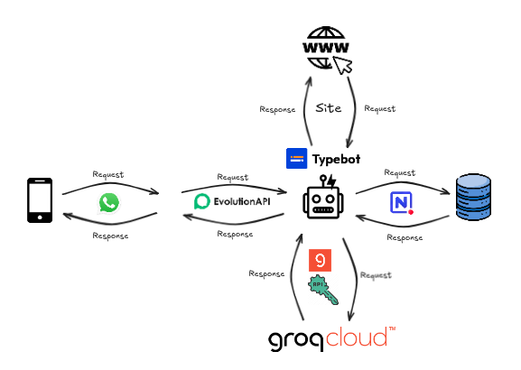

<h1 align="center">Clinimagem Bot </h1>

<div align="center">


</div>

## Sumário

* [Integrantes](#integrantes)
* [Descrição](#descrição)
* [Requisitos](#requisitos)
* [Tecnologias](#tecnologias)
* [Fluxo do Software](#fluxo-do-software)
* [Dificuldades](#dificuldades)
* [Resultados](#resultados)
* [Como_Usar](#como_usar)
* [Conclusão](#conclusao)

## Integrantes

- Anderson do Vale - [and3510](https://github.com/and3510) 
- Beatriz Barreto - [whosbea](https://github.com/whosbea)
- Cristovam Paulo - [cristovam10000](https://github.com/cristovam10000)
- Guilherme de Assis - [onizuka465](https://github.com/onizuka465)
- Gustavo do Vale - [gustavodovale](https://github.com/gustavodovale)
- Lucas Cesar - [lucascesar1107](https://github.com/lucascesar1107)

## Descrição

Chatbot para Atendimento de uma Clinica "Clinimagem",para obter informações de forma rápida e precisa

## Requisitos

- [x] Cadastro do Usuario ao bot
- [x] Regras LGBD para Cadastro
- [x] Informações sobre Convênios
- [x] Informações sobre o Preparativo para Exames Laboratoriais e de Imagem
- [x] Disponização do link para consulta dos exames do paciente
- [x] Informações sobre Consultas
- [x] Exames do DETRAN
- [x] Exames de Medicina do Trabalho
- [x] Retornar ao Menu Principal
- [x] Resultados de Exames
- [x] Tranferencia para o atendimento ao cliente
- [x] Encerrar atendimento
- [x] Função de Avaliação do chatbot
- [ ] IA para tirar duvidas
- [ ] Lista de Botões 
- [ ] Botões

## Tecnologias

- **Typebot**: Plataforma para criar chatbots interativos, sem programação complexa.
- **NocoDB**: Banco de dados visual que transforma dados em planilhas.
- **Evolution API**: Automação para envio de mensagens via WhatsApp.
- **WhatsApp**: Plataforma para troca de mensagens e comunicação instantânea.
- **Gemini**: IA para geração de conversas em linguagem natural da Google.
- **Docker**: Virtualização de aplicações em contêineres para qualquer ambiente.
- **Postman**: Ferramenta para testar, monitorar e documentar APIs.


## Fluxo do Software

<div align="center">
  


</div>


## Dificuldades


## Resultados

<div align="center">
  

<p>Projeto foi divido em pedaços para facilitar a movimentação pelos fluxos e manutenção</p>

</div>

## Como_Usar

> Embora eu não possa mostrar os dados das tabelas e o template do fluxo, disponibilizei o material para quem quiser iniciar um projeto com uma ideia diferente.


> Antes de tentar usar, é importante ja saber como usar as plataformas [**Typebot**](https://docs.typebot.io/get-started/introduction) e [**NocoDb**](https://docs.nocodb.com/)

### 1° Etapa (Criação de contas e configuração)

1. **Criar Conta no Typebot:**

   - Acesse o site do Typebot e siga as instruções para criar uma conta. 

2. **Criar Conta no NocoDB:**

   - Acesse o site do NocoDB e registre-se para criar sua conta.

3. **Integração entre Typebot e NocoDB:**

   O Typebot oferece suporte direto para o NocoDB, facilitando a integração. Para configurar, siga os passos abaixo:

   - **Token de Autenticação:** 
     - Você precisará fornecer o token da API do NocoDB para autenticar a conexão.

   - **IDs das Tabelas:** 
     - Quando solicitado pela integração, especifique os **Table IDs** das tabelas que deseja acessar.

<div align="center">


</div>


### 2ª Etapa: Criando um Contêiner para Rodar a Evolution API

1. **Navegue até o diretório do arquivo `docker-compose.yml`:**
> Estarei usando a versão 1.8.2 do Evolution API
  
   Use o seguinte comando para acessar a pasta do projeto:

   ```bash
   cd Clinimagem_Project
   ```

2. **Execute o stack com o Docker Compose no `Clinimagem_Project/docker/docker-compose.yml`:**

   Antes de fazer um `docker-compose up`, crie um arquivo **.env** na mesma pasta do **docker-compose.yml**

   e adicione:


   ```
   AUTHENTICATION_API_KEY= senha da chave api evolution


   POSTGRES_DB=nome do database
   POSTGRES_USER=nome do usuario
   POSTGRES_PASSWORD=senha do database
   ```


   Para iniciar os serviços definidos no Docker Compose, utilize o comando:

   ```bash
   docker-compose up
   ```
   Se não tiver docker, veja a [documentação](https://www.docker.com/) 

3. **Acesse a API localmente:**

   Após executar o comando acima, um contêiner chamado **evolution-whatsapp_api-1** será iniciado na porta 8080. Para verificar se a API está rodando corretamente, abra o navegador e acesse:

   ```
   https://localhost:8080
   ```

   No entanto, para que o Typebot possa fazer requisições HTTP, precisamos expor a porta 8080 para a internet.

4. **Exponha a porta com Ngrok:**

   Execute o seguinte comando para expor a porta 8080:

   ```bash
   ngrok http 8080
   ```

   Isso irá gerar uma URL pública que redireciona as requisições para sua API local. Caso nunca tenha usado o Ngrok, consulte a [documentação oficial](https://ngrok.com/docs/) para mais informações.


   <div align="center">

    


  </div>

5. **Acesse a API pela internet:**

   Como mostrado na imagem, copie a URL gerada pelo Ngrok (por exemplo, `https://4e1f-138-121-129-56.ngrok-free.app`) e cole no navegador. Agora, sua Evolution API está acessível pela internet!

   lembrando, que sua url será diferente.

--- 


### 3ª Etapa: Configurando o Typebot na Evolution API

1. **Acessar o Gerenciador:**

   - Abra o navegador e acesse o gerenciador da API por meio da URL gerada pelo Ngrok:

     ```
     https://4e1f-138-121-129-56.ngrok-free.app/manager
     ```

   - Você verá um formulário de login semelhante ao da imagem abaixo:

    <div align="center">

    


    </div>

   - O `ApiKey` padrão do Gerenciador é **4D2883EC3249AD0271123319BB6E7ABD**. Caso queira alterar, edite o arquivo `docker-compose.yml`.

    <div align="center">

    


    </div>
  

2. **Conectar seu WhatsApp à Evolution API:**

   - Primeiro, será necessário criar uma **instância** para conectar o WhatsApp.

    <div align="center">

    


    </div>

   - Escolha o tipo de integração: **Cloud API** ou **Baileys**.  
     **Dica:** Utilize Baileys se você não estiver usando o WhatsApp Business.

   - Após criar a instância, clique nela para acessar a configuração da Evolution API.


    <div align="center">

    


    </div>

    - Agora conecte seu whatsapp com o API, usando Scan QRCODE do aplicativo.


    <div align="center">

    


    </div>

3. **Configurar o Typebot:**

   - Dentro da instância da Evolution API, vá até a seção de configuração do **Typebot**.

   - No início do fluxo, existem três variáveis que precisam ser preenchidas:

    <div align="center">

    


    </div>

     - **apikey**: A chave de API que você está utilizando.
     - **instance**: A instância que você criou anteriormente.
     - **baseUrl**: A URL base da API (gerada pelo Ngrok).

   - Agora, vamos configurar a API para receber corretamente o fluxo do Typebot. Para isso, o fluxo precisa estar **publicado**.

    <div align="center">

    


    </div>

   - Na configuração da API, utilize a URL:

     ```
     https://typebot.co
     ```

     E no campo **Nome do Fluxo**, insira o nome do fluxo correspondente, por exemplo: `"exemlo_1231`.

    
    <div align="center">

    


    </div>

---


Depois disso, envie uma mensagem para o número registrado na API e veja a mágica acontecer!

### Resumo dos Requisitos Necessários:

1. Tabelas: Todas as tabelas criadas e configuradas no fluxo, com os IDs das tabelas corretos.
2. API Evolution: API Evolution em execução no Docker, com a porta 8080 exposta na internet através do Ngrok.
3. Configuração de Parâmetros: Parâmetros adequadamente configurados no fluxo e na API Evolution para garantir que as requisições sejam processadas corretamente.


## Conclusão
